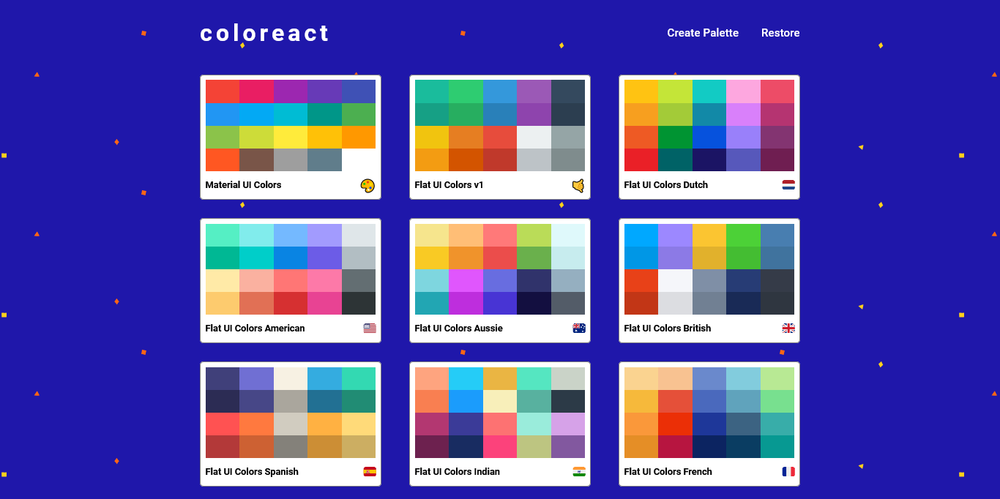
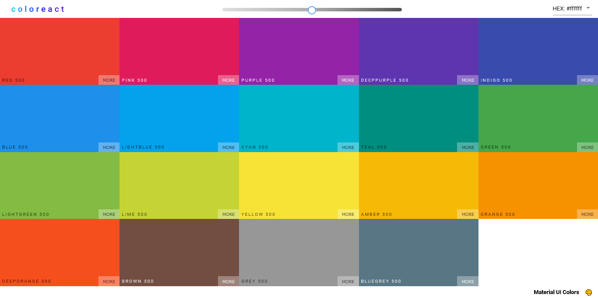
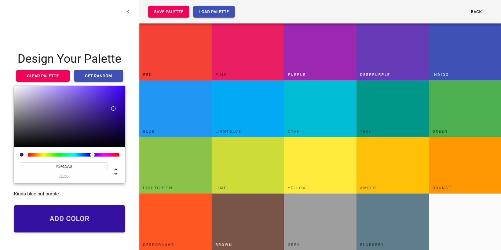
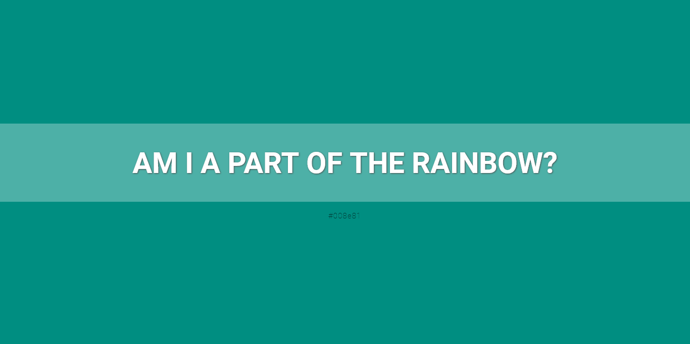
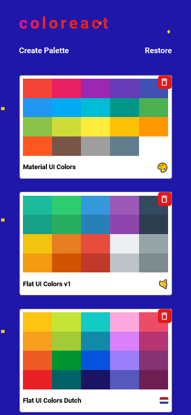
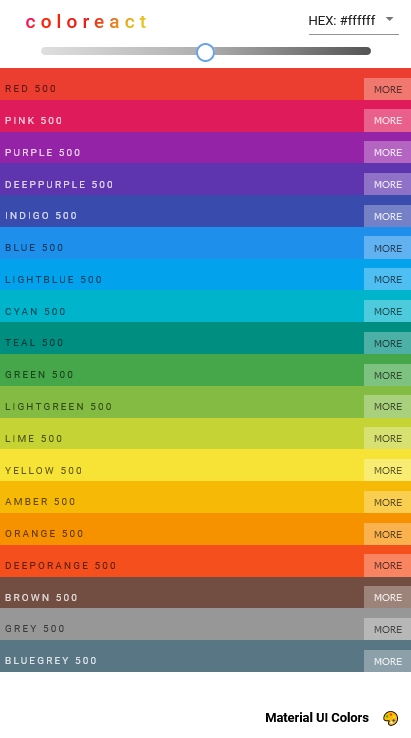
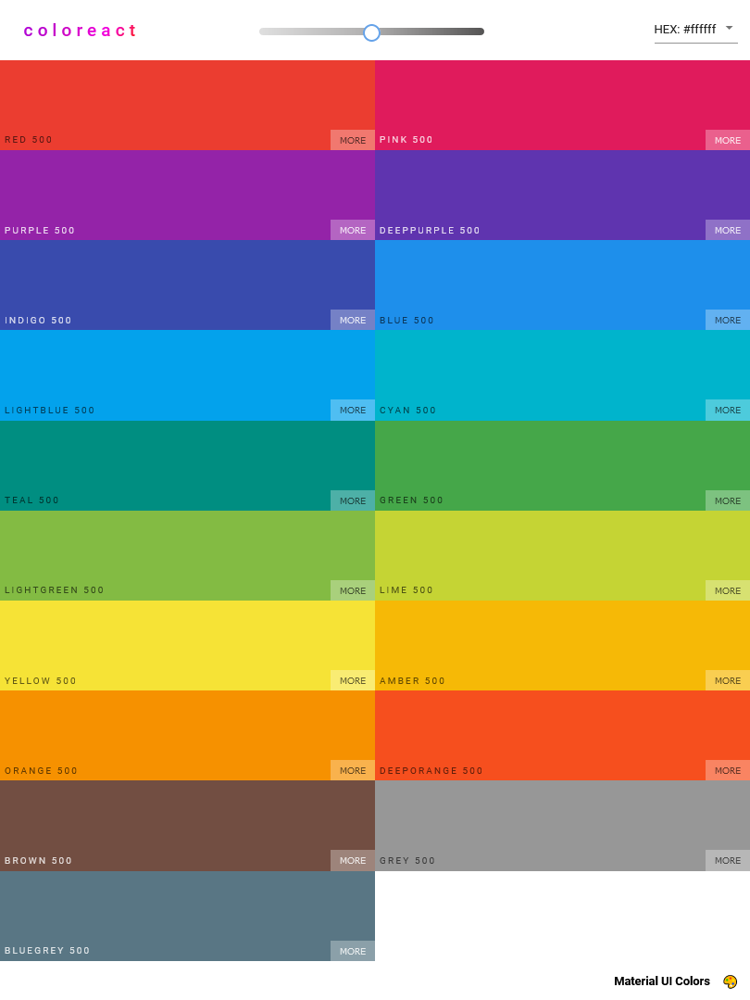

# Coloreact

This is a color palette generator inspired by [Flat UI Colors](https://flatuicolors.com/) website. Project was bootstrapped with [Create React App](https://github.com/facebook/create-react-app).
[Click here](https://ravviolo.github.io/coloreact) to view the app.

## Table of contents

  - [Overview](#overview)
    - [Features](#features)
    - [Screenshots](#screenshots)
    - [Deployment](#deployment)
  - [My process](#my-process)
    - [Built with](#built-with)
    - [What I learned](#what-i-learned)

## Overview

### Features

- Browse through default color palettes
- Create new palettes using color picker
- Reorder your colors with drag and drop functionality
- No idea which color is best for you? Choose a random color to help you get creative
- Name your colors and palettes however you like, you can use emoji too
- Edit existing palettes to create new color combinations
- Easily delete a palette if you don't need it
- Copy a color in different formats - HEX, RBG or HSL
- Adjust color's lightness to fit your needs

Website uses local storage to save your palettes, so you won't lose what you created!

### Screenshots

Desktop

Mobile

### Deployment

Website is hosted using [GitHub Pages](https://pages.github.com/).

## My process

### Built with

- [React](https://reactjs.org/) as main UI tool
- [React Router](https://github.com/remix-run/react-router) for client-side routing
- [Context API](https://reactjs.org/docs/context.html) for sharing data between components
- [Material UI](https://mui.com/material-ui/) for styling

Other

- [emoji-mart](https://www.npmjs.com/package/emoji-mart)
- [chroma.js](https://gka.github.io/chroma.js/)
- [react-copy-to-clipboard](https://www.npmjs.com/package/react-copy-to-clipboard)
- [rc-slider](https://www.npmjs.com/package/rc-slider)
- [array-move](https://www.npmjs.com/package/array-move)
- [react-color](https://www.npmjs.com/package/react-color)
- [react-sortable-hoc](https://www.npmjs.com/package/react-sortable-hoc)
- [react-material-ui-form-validator](https://www.npmjs.com/package/react-material-ui-form-validator)
- [react-transition-group](https://www.npmjs.com/package/react-transition-group)

### What I learned

- Building and connecting React components in complex layouts
- Understanding the importance of design system, using common tools to achieve visually pleasing UI
- Creating simple animations and page transitions
- Client-Side Routing
- Sharing 'global' data using Context API
- Saving data to local storage
